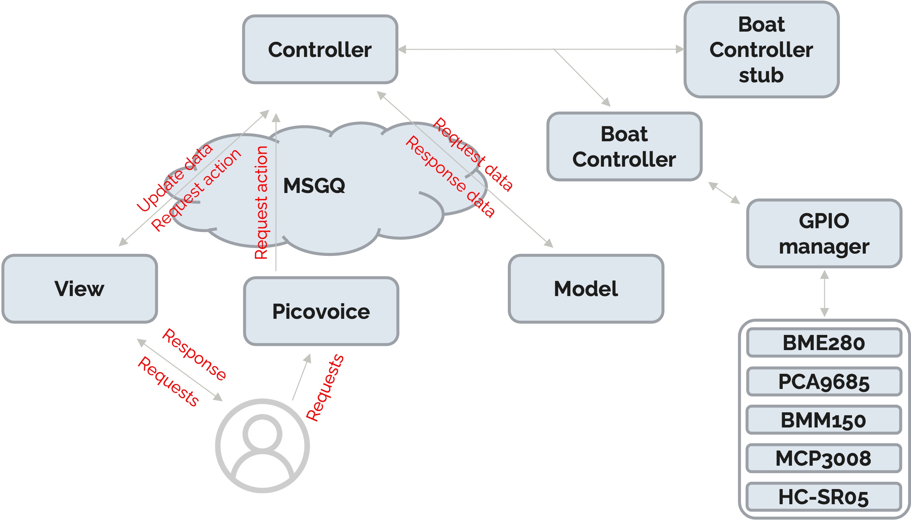

# L'architecture du code 

Dans le cas où vous souhaité réaliser des modifications nous avons respecter une architecture respectant le modèle _MVC (Model Vue Controler)_. \
- Le code lié à l'utilisation des capteurs et actionneur se trouve dans _boat controler_
- Le code lié à la commande vocale dans _voice controler_
- Le code lié à l'IHM dans _gui_ et _model_

N'oublié pas que vous pouvez vous affranchire de la maquette en utilisant le mode stub, expliqué dans la section [_Aperçu général_](./overview.md#sur-un-os-différent-de-la-cible-mode-stub)

