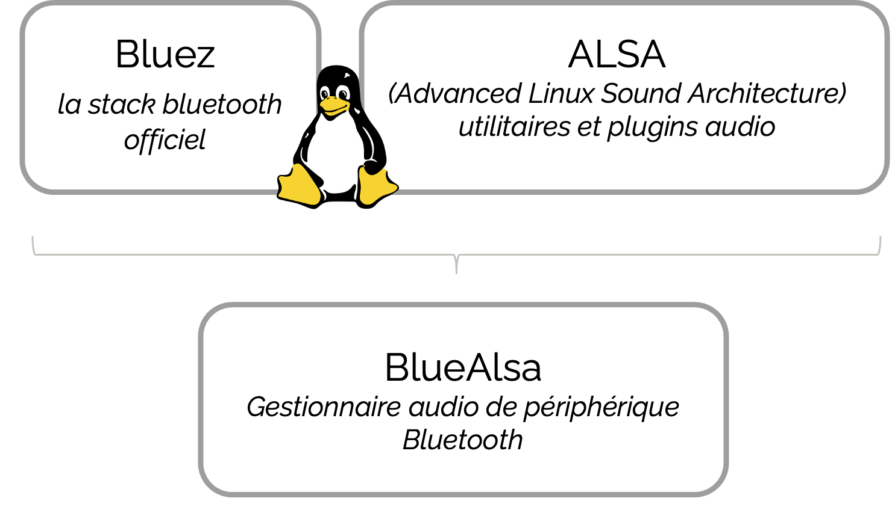

# Bluetooth

Il existe plusieurs manière de connecter un périphèrique en bluetooth sur un OS Linux. Si vous utilisé _pulseaudio_ ou _pipewire_, cette page ne sera pas nécessaire car elle s'appuye sur l'utilisation de _Bluealsa_.


## Bluealsa c'est quoi ?

Bluealsa, c'est l'utilisation commune de _BlueZ_ la stack officiel de linux qui permet l'utilisation du bluetooth et de _ALSA_ un utilitaire pour configurer et utilisé des cartes audios. Finalement leurs utilisations commune permet de gérer des périphérique bluetooth audio.



## Configuration d'un périphérique Bluetooth

Avant de contrôler notre bateau par la commande vocal et un équipement bluetooth, il faut connecter l'équipement avec les commandes fournis par BlueZ. 
Le protocole est assez simple, il s'agit des mêmes étapes qu'avec l'utilisation d'une IHM mais avec des lignes de commandes.

```bash 
$ bluetoothctl scan on                # permet de trouver notre équipement 
$ bluetoothctl trust <MAC_ADRESSE>    # de lui faire confiance
$ bluetoothctl pair <MAC_ADRESSE>     # de se lier à lui
$ bluetoothctl connect <MAC_ADRESSE>  # de s'y connecter
```

Maintenant que l'on est connecté nous allons créer un fichier de configuration alsa pour utiliser notre casque comme périphérique par défaut. Ce fichier de configuration est à créer sous le nom de `~/.asoundrc`.

```sh
# device configuration
pcm.btreceiver { 
    type plug 
    slave.pcm { 
        type bluealsa 
        device "MAC_ADRESSE"
        profile "sco" # utilisation du profil HSP/HFP
    } 
    hint { 
        show on 
        description "Bluetooth Receiver" 
    } 
}

# default device
pcm.!default {
    type plug
    slave.pcm "btreceiver"
}
```

Il est impotant d'utiliser le profile _sco_ qui en réalité n'en est pas un, mais un protocole de communication utilisé par le profil _HSP/HFP_. Cette mention indique alors qu'on utilise les bons profile. \
Le HSP/HFP les profils qui produisent les meilleurs codec pour une qualité optimal, cependant on utilise que le microphone donc cela n'est pas dérengant. De plus certain profil comme l'_A2DP_ fonctionne uniquement en playback, le microphone n'est pas utilisable. Il est important de configurer notre équipement avec c'est profil pour un bon fonctionnement.

