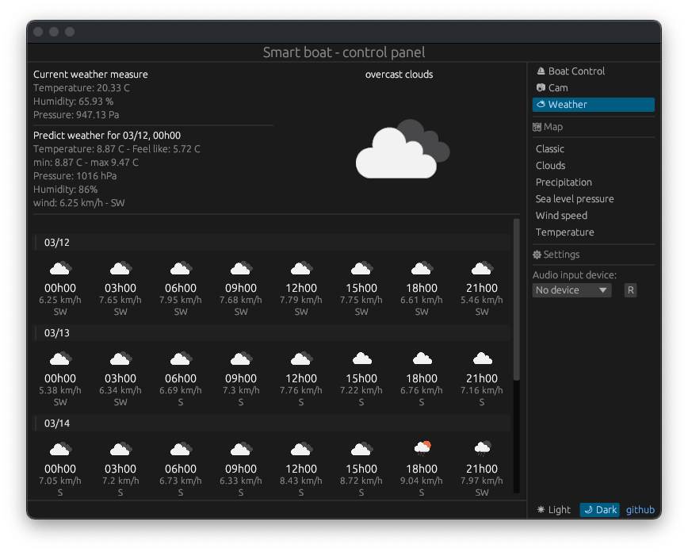

# Capteur de température, humidité et pression 



La page _Weather_ de l'interface graphique permet d'avoir une prédiction météorologique incluant la température, la vitesse du vent ainsi que sa direction sur 5 jours. \
Grâce à un capteur i2c intégré au bateau, le _BME280_, une mesure en temps réel de la température, humidité et pression est également disponible.

## Configuration du BME280

Avant de réaliser une lecture de donnée météorologique, il est nécessaire de configurer le capteur. On notera 3 registres:

Nom | Adresse | Information 
----|---------|------------
HUM_CTRL | _0xf2_ | Configuration du prescaler et de la précision pour la mesure d'humidité
MEAS_CTRL | _0xf4_ | Configuration du prescaler et de la précision pour la mesure de température et de pression
CONFIG | _0xf5_ | Configuration du mode d'allimentation

Dans notre cas nous avons décidé d'utiliser les valeurs suivantes:


```rust
pub fn init(&mut self, gpio: &mut Gpio){
    gpio.i2c_set_slave_addr(BME280_ADDR);
    gpio.i2c_write_byte(HUM_CTRL_ADDR, 0x01);
    gpio.i2c_write_byte(CTRL_MEAS_ADDR, 0x27);
    gpio.i2c_write_byte(BME280_CONFIG_ADDR, 0x00);
}
```

## Lecture de la température

Une fois que le capteur est configuré, nous pouvons commencer par lire la température qui est une valeur sur 3 octets, il faut alors lire les registres suivants: _0xfa, 0xfb, 0xfc_

```rust
pub fn get_temperature(&mut self, gpio: &mut Gpio) -> f32{
    gpio.i2c_set_slave_addr(BME280_ADDR);
    let msb: u8 = gpio.i2c_read_byte_from(TEMP_ADDR[MSB]);    // 0xfa
    let lsb: u8 = gpio.i2c_read_byte_from(TEMP_ADDR[LSB]);    // 0xfb
    let xlsb: u8 = gpio.i2c_read_byte_from(TEMP_ADDR[XLSB]);  // 0xfc
    let temp_raw: i32 = ((msb as i32) << 12) | ((lsb as i32) << 4) | xlsb as i32;

    let temperature_in_C: f32 = (self.compensation_temperature(gpio, temp_raw)) as f32 / 100.0;

    temperature_in_C
}
```

La valeur obtenue _temp\_raw_, correspond à la température brute. Il faut compenser cette valeur à l'aide de constantes propres à chaque capteur qui sont ajustées en usine. \
Pour la température, les registres intéressants sont les suivantes:

Nom | Adresse | n bits
----|---------|--------
T1_ADDR | _0x89, 0x88_ | 2 * _u8_
T2_ADDR | _0x8b, 0x8a_ | 2 * _u8_
T3_ADDR | _0x8d, 0x8c_ | 2 * _u8_

Avec la fonction `compensation_temperature` on obtient alors la température en degrés Celsius. Les fonctions de compensation sont données dans la documentation du BME280.

```rust
fn compensation_temperature(&mut self, gpio: &mut Gpio, temp_raw: i32) -> i32 {
    let mut msb = gpio.i2c_read_byte_from(T1_ADDR[MSB]);
    let mut lsb = gpio.i2c_read_byte_from(T1_ADDR[LSB]);
    let dig_t1: u16 = ((msb as u16) << 8) | lsb as u16;

    msb = gpio.i2c_read_byte_from(T2_ADDR[MSB]);
    lsb = gpio.i2c_read_byte_from(T2_ADDR[LSB]);
    let dig_t2: i16 = (((msb as u16) << 8) | lsb as u16) as i16;

    msb = gpio.i2c_read_byte_from(T3_ADDR[MSB]);
    lsb = gpio.i2c_read_byte_from(T3_ADDR[LSB]);
    let dig_t3: i16 = (((msb as u16) << 8) | lsb as u16) as i16;

    let var1  = ((((temp_raw >> 3) - ((dig_t1 as i32) << 1))) * (dig_t2 as i32)) >> 11; 
    let var2  = ((((temp_raw >> 4) - (dig_t1 as i32)) * ((temp_raw >> 4) - ((dig_t1 as i32))) >> 12) * (dig_t3 as i32)) >> 14;
    self.t_fine = var1 + var2;
    let temp = (self.t_fine * 5 + 128) >> 8;

    temp
}
```

Nous pouvons maintenant réaliser la lecture de la pression et de l'humidité qui se décompose de la même manière.

## Lecture de la pression


Nom | Adresse | n bits
----|---------|--------
PRESS_ADDR | _0xf7, 0xf8, 0xf9_ | 3 * _u8_
||
P1_ADDR | _0x8f, 0x8e_ | 2 * _u8_
P2_ADDR | _0x91, 0x90_ | 2 * _u8_
P3_ADDR | _0x93, 0x92_ | 2 * _u8_
P4_ADDR | _0x95, 0x94_ | 2 * _u8_
P5_ADDR | _0x97, 0x96_ | 2 * _u8_
P6_ADDR | _0x99, 0x98_ | 2 * _u8_
P7_ADDR | _0x9b, 0x9a_ | 2 * _u8_
P8_ADDR | _0x9d, 0x9c_ | 2 * _u8_
P9_ADDR | _0x9f, 0x9e_ | 2 * _u8_


```rust
pub fn get_pressure(&mut self, gpio: &mut Gpio) -> f32{
    gpio.i2c_set_slave_addr(BME280_ADDR);
    let msb: u8 = gpio.i2c_read_byte_from(PRESS_ADDR[MSB]);
    let lsb: u8 = gpio.i2c_read_byte_from(PRESS_ADDR[LSB]);
    let xlsb: u8 = gpio.i2c_read_byte_from(PRESS_ADDR[XLSB]);
    let press_raw: i32 = ((msb as i32) << 12) | ((lsb as i32) << 4) | xlsb as i32;

    let pressure_in_pa = (self.compensation_pressure(gpio, press_raw) as f32)/256.0;

    pressure_in_pa
}

fn compensation_pressure(&self, gpio: &Gpio, press_raw: i32) -> u32{
    let mut msb = gpio.i2c_read_byte_from(P1_ADDR[MSB]);
    let mut lsb = gpio.i2c_read_byte_from(P1_ADDR[LSB]);
    let dig_p1: u16 = ((msb as u16) << 8) | lsb as u16;

    msb = gpio.i2c_read_byte_from(P2_ADDR[MSB]);
    lsb = gpio.i2c_read_byte_from(P2_ADDR[LSB]);
    let dig_p2: i16 = (((msb as u16) << 8) | lsb as u16) as i16;

    msb = gpio.i2c_read_byte_from(P3_ADDR[MSB]);
    lsb = gpio.i2c_read_byte_from(P3_ADDR[LSB]);
    let dig_p3: i16 = (((msb as u16) << 8) | lsb as u16) as i16;

    msb = gpio.i2c_read_byte_from(P4_ADDR[MSB]);
    lsb = gpio.i2c_read_byte_from(P4_ADDR[LSB]);
    let dig_p4: i16 = (((msb as u16) << 8) | lsb as u16) as i16;

    msb = gpio.i2c_read_byte_from(P5_ADDR[MSB]);
    lsb = gpio.i2c_read_byte_from(P5_ADDR[LSB]);
    let dig_p5: i16 = (((msb as u16) << 8) | lsb as u16) as i16;

    msb = gpio.i2c_read_byte_from(P6_ADDR[MSB]);
    lsb = gpio.i2c_read_byte_from(P6_ADDR[LSB]);
    let dig_p6: i16 = (((msb as u16) << 8) | lsb as u16) as i16;

    msb = gpio.i2c_read_byte_from(P7_ADDR[MSB]);
    lsb = gpio.i2c_read_byte_from(P7_ADDR[LSB]);
    let dig_p7: i16 = (((msb as u16) << 8) | lsb as u16) as i16;

    msb = gpio.i2c_read_byte_from(P8_ADDR[MSB]);
    lsb = gpio.i2c_read_byte_from(P8_ADDR[LSB]);
    let dig_p8: i16 = (((msb as u16) << 8) | lsb as u16) as i16;

    msb = gpio.i2c_read_byte_from(P9_ADDR[MSB]);
    lsb = gpio.i2c_read_byte_from(P9_ADDR[LSB]);
    let dig_p9: i16 = (((msb as u16) << 8) | lsb as u16) as i16;


    let mut var1: i64 = (self.t_fine as i64) - 128000;
    let mut var2: i64 = var1 * var1 * (dig_p6 as i64);
    var2 = var2 + ((var1 * (dig_p5 as i64)) << 17);
    var2 = var2 + ((dig_p4 as i64) << 35);
    var1 = ((var1 * var1 * (dig_p3 as i64)) >> 8) + ((var1 * (dig_p2 as i64)) << 12);
    var1 = ((((1 as i64) << 47) + var1)) * (dig_p1 as i64) >> 33;

    if var1 == 0 {
        return 0;
    }

    let mut p: i64 = 1048576 - (press_raw as i64);
    p = (((p << 31) - var2)*3125)/var1;
    var1 = ((dig_p9 as i64) * (p>>13) * (p>>13)) >> 25;
    var2 = ((dig_p8 as i64) * p) >> 19;
    p = ((p + var1 + var2) >> 8) + ((dig_p7 as i64)<<4);

    let pressure: u32 = (p as u32)/100;

    pressure
}
```

## Lecture de l'humidité

Nom | Adresse | n bits
----|---------|--------
PRESS_ADDR | _0xfd, 0xfe_ | 2 * _u8_
||
H1_ADDR | _0xa1_ | 1 * _u8_
H2_ADDR | _0xe2, 0xe1_ | 2 * _u8_
H3_ADDR | _0xe3_ | 1 * _u8_
H4_ADDR | _0xe4, 0xe5_ | 2 * _u8_
H5_ADDR | _0xe6, 0xe5_ | 2 * _u8_
H6_ADDR | _0xe7_ | 1 * _u8_


```rust
pub fn get_humidity(&mut self, gpio: &mut Gpio) -> f32{
    gpio.i2c_set_slave_addr(BME280_ADDR);
    let msb: u8 = gpio.i2c_read_byte_from(HUM_ADDR[MSB]);
    let lsb: u8 = gpio.i2c_read_byte_from(HUM_ADDR[LSB]);
    let hum_raw: i16 = (((msb as u16) << 8) | lsb as u16) as i16;

    let hum_in_percent = (self.compensation_humidity(gpio, hum_raw as i32) as f32)/1024.0;

    hum_in_percent
}

fn compensation_humidity(&self, gpio: &Gpio, hum_raw: i32) -> i32{
    let dig_h1: u8 = gpio.i2c_read_byte_from(H1_ADDR);

    let mut msb = gpio.i2c_read_byte_from(H2_ADDR[MSB]);
    let mut lsb = gpio.i2c_read_byte_from(H2_ADDR[LSB]);
    let dig_h2: i16 = (((msb as u16) << 8) | lsb as u16) as i16;

    let dig_h3: u8 = gpio.i2c_read_byte_from(H3_ADDR);

    msb = gpio.i2c_read_byte_from(H4_ADDR[MSB]);
    lsb = gpio.i2c_read_byte_from(H4_ADDR[LSB]);
    let dig_h4: i16 = (((msb as u16) << 4) | ((lsb & 0x0f) as u16)) as i16;

    msb = gpio.i2c_read_byte_from(H5_ADDR[MSB]);
    lsb = gpio.i2c_read_byte_from(H5_ADDR[LSB]);
    let dig_h5: i16 = (((msb as u16) << 4) | (((lsb >> 4) & 0x0f) as u16)) as i16;

    let dig_h6: i8 = gpio.i2c_read_byte_from(H6_ADDR) as i8;

    let mut v_x1: i32 = self.t_fine - (76800 as i32);
    v_x1 = ((((hum_raw << 14) -((dig_h4 as i32) << 20) - ((dig_h5 as i32) * v_x1)) + (16384 as i32)) >> 15) * (((((((v_x1 * (dig_h6 as i32)) >> 10) *
            (((v_x1 * (dig_h3 as i32)) >> 11) + (32768 as i32))) >> 10) + (2097152 as i32)) * (dig_h2 as i32) + 8192) >> 14);
    v_x1 = v_x1 - (((((v_x1 >> 15) * (v_x1 >> 15)) >> 7) * (dig_h1 as i32)) >> 4);
    v_x1 = v_x1.clamp(0, 419430400);
    let hum: i32 =  ((v_x1 >> 12)) as i32;

    hum
}
```


