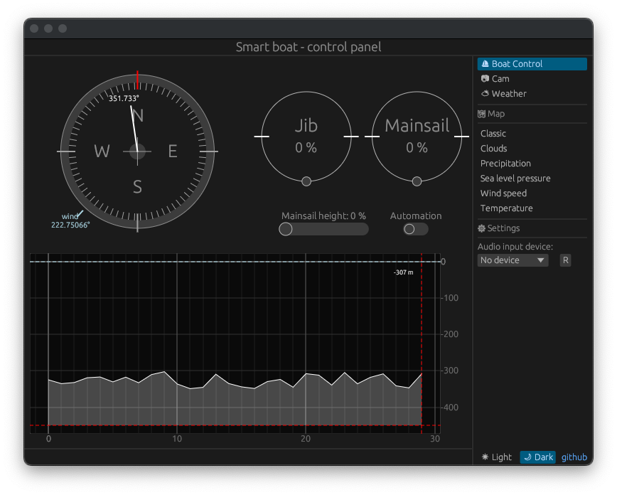

# Boussole



La page principale permet de contrôler le bateau et d'avoir différentes informations. Nous allons commencer par l'aiguille blanche présente sur le cadran qui représente la boussole. \
Grâce à un capteur i2c intégré au bateau, le _BMM150_, une mesure en temps réel de la position par rapport au nord est disponible.


## Configuration du BMM150


Dans un premier temps il est nécessaire de réaliser une configuration du capteur comme pour le _BME280_.

Nom | Adresse | Information 
----|---------|------------
CTRL_POWER_REGISTER | _0x4b_ | Permets de configurer le mode d'alimentation
MODE_RATE_REGISTER | _0x4c_ | Permets de configurer la fréquence de fonctionnement
REG_REP_XY | _0x51_ | Permets de configurer la précision des axes X et Y
REG_REP_Z | _0x52_ | Permets de configurer la précision de l'axe Z
REG_AXES_ENABLE | _0x4e_ | Permets d'activer ou de désactiver les axes souhaités.

Dans notre cas nous allons utiliser la configuration suivante:

```rust
pub fn init(&mut self, gpio: &mut Gpio){
    self.set_power_bit(ENABLE_POWER, gpio);
    thread::sleep(Duration::from_millis(3)); 
    let chip_id = self.get_chip_id(gpio);
    if chip_id == CHIP_ID_VALUE {
        println!("bmm150 init sucess");
        self.get_trim_value(gpio);
        self.set_operation_mode(POWERMODE_NORMAL, gpio);
        self.set_preset_mode(PRESETMODE_HIGHACCURACY, gpio);
        self.set_rate(RATE_10HZ, gpio);
        self.set_measurement_xyz(true, true, true, gpio);
    }
    else {
        println!("bmm150 init fail");
    }
}
```

Les différentes fonctions de configuration sont disponibles dans le fichier [_bmm150.rs_](https://github.com/tanguy-rdt/depot-smart-boat/blob/main/src/boat_control/bmm150.rs) de notre dépôt.

## Lecture des paramètres de compensation

Le _BMM150_ est un capteur Bosch, comme pour le _BME280_. Le principe de fonctionnement est le même, les valeurs lues dans les registres sont des données brutes. Il faut donc les compenser.

Nom | Adresse | n bits
----|---------|--------
DIG_X1     | _0x5D_ | 1 * _u8_
DIG_Z4_LSB | _0x62_ | 1 * _u8_
DIG_Z2_LSB | _0x68_ | 1 * _u8_


```rust
fn get_trim_value(&mut self, gpio: &mut Gpio) {
    gpio.i2c_set_slave_addr(BMM150_ADDR);

    let mut trim_x1_y1 = [0u8; 2];
    gpio.i2c_read_bytes_from(DIG_X1, &mut trim_x1_y1);

    let mut trim_xyz_data = [0u8; 4];
    gpio.i2c_read_bytes_from(DIG_Z4_LSB, &mut trim_xyz_data);

    let mut trim_xy1_xy2 = [0u8; 10];
    gpio.i2c_read_bytes_from(DIG_Z2_LSB, &mut trim_xy1_xy2);

    self.trim_data.dig_x1 = trim_x1_y1[0] as i8;
    self.trim_data.dig_y1 = trim_x1_y1[1] as i8;
    self.trim_data.dig_x2 = trim_xyz_data[2] as i8;
    self.trim_data.dig_y2 = trim_xyz_data[3] as i8;
    let temp_msb: u16 = (trim_xy1_xy2[3] as u16) << 8;
    self.trim_data.dig_z1 = temp_msb | trim_xy1_xy2[2] as u16;
    let temp_msb: u16 = (trim_xy1_xy2[1] as u16) << 8;
    self.trim_data.dig_z2 = (temp_msb | trim_xy1_xy2[0] as u16) as i16;
    let temp_msb: u16 = (trim_xy1_xy2[7] as u16) << 8;
    self.trim_data.dig_z3 = (temp_msb | trim_xy1_xy2[6] as u16) as i16;
    let temp_msb: u16 = (trim_xyz_data[1] as u16) << 8;
    self.trim_data.dig_z4 = (temp_msb | trim_xyz_data[0] as u16) as i16;
    self.trim_data.dig_xy1 = trim_xy1_xy2[9];
    self.trim_data.dig_xy2 = trim_xy1_xy2[8] as i8;
    let temp_msb: u16 = ((trim_xy1_xy2[5] & 0x7F) as u16) << 8;
    self.trim_data.dig_xyz1 = temp_msb | trim_xy1_xy2[4] as u16;
}
```

C'est des valeurs qui ne change pas, il suffit de les lires une fois et de les utiliser au moment de la compensation.


## Lecture des axes et compensations

La lecture des axes peut être faite en une seule fois puisque les registres se suivent, le premier registre à lire le _REG\_DATA\_X\_LSB_ correspond à l'adresse _0x42_.

```rust
pub fn get_geomagnetic(&mut self, gpio: &mut Gpio) -> (i16, i16, i16){
    gpio.i2c_set_slave_addr(BMM150_ADDR);

    let mut rslt = [0u8; 8];
    gpio.i2c_read_bytes_from(REG_DATA_X_LSB, &mut rslt);

    let reg_data = (rslt[0] & 0xF8) >> 3;
    let msb_data = ((rslt[1] as i8) as i16) * 32;
    let geomagnetic_raw_x = msb_data | reg_data as i16;

    let reg_data = (rslt[2] & 0xF8) >> 3;
    let msb_data = ((rslt[3] as i8) as i16) * 32;
    let geomagnetic_raw_y = msb_data | reg_data as i16;

    let reg_data = (rslt[4] & 0xFE) >> 1;
    let msb_data = ((rslt[5] as i8) as i16) * 128;
    let geomagnetic_raw_z = msb_data | reg_data as i16;

    let reg_data = (rslt[6] & 0xFC) >> 2;
    let msb_data = (rslt[7] as u16) << 6;
    let geomagnetic_raw_r = msb_data | reg_data as u16;

    self.geomagnetic_x = self.compensate_x(geomagnetic_raw_x, geomagnetic_raw_r);
    self.geomagnetic_y = self.compensate_y(geomagnetic_raw_y, geomagnetic_raw_r);
    self.geomagnetic_z = self.compensate_z(geomagnetic_raw_z, geomagnetic_raw_r);

    (self.geomagnetic_x, self.geomagnetic_y, self.geomagnetic_z)
}
```

On peut ensuite compenser ces valeurs grâce aux constantes obtenues précédemment et aux fonctions données dans la documentation.

```rust 
fn compensate_x(&self, x: i16, r: u16) -> i16{ 
    if x != -4096{
        let process_comp_x0: u16 = if r != 0 { r }
        else if self.trim_data.dig_xyz1 != 0 { self.trim_data.dig_xyz1 }
        else { 0 };

        if process_comp_x0 != 0 {
            let process_comp_x1: i32 = ((self.trim_data.dig_xyz1 as i32)*16384)/process_comp_x0 as i32;
            let process_comp_x2: i32 = (process_comp_x1 as i32) - 0x4000;
            let mut retval: i32 = process_comp_x2;
            let process_comp_x3: i32 = retval * retval;
            let process_comp_x4: i32 = (self.trim_data.dig_xy2 as i32) * (process_comp_x3/128);
            let process_comp_x5: i32 = ((self.trim_data.dig_xy1 as i16) * 128) as i32;
            let process_comp_x6: i32 = (retval) * process_comp_x5;
            let process_comp_x7: i32 = (process_comp_x4 + process_comp_x6)/512 + (0x100000 as i32);
            let process_comp_x8: i32 = ((self.trim_data.dig_x2 as i16) + (0xA0 as i16)) as i32;
            let process_comp_x9: i32 = (process_comp_x7 * process_comp_x8)/4096;
            let process_comp_x10: i32 = (x as i32) * process_comp_x9;
            retval = process_comp_x10/8192;
            retval = (retval + (self.trim_data.dig_x1 as i32) * 8) / 16;
            retval as i16
        }
        else {
            -32768
        }
    }
    else {
        -32768
    }
}

fn compensate_y(&self, y: i16, r: u16) -> i16{ 
    if y != -4096{
        let process_comp_y0: u16 = if r != 0 { r }
        else if self.trim_data.dig_xyz1 != 0 { self.trim_data.dig_xyz1 }
        else { 0 };

        if process_comp_y0 != 0 {
            let process_comp_y1: i32 = (self.trim_data.dig_xyz1 as i32)*16384/process_comp_y0 as i32;
            let process_comp_y2_temp: i32 = process_comp_y1 as i32 - 0x4000;
            let process_comp_y2: u16 = if process_comp_y2_temp < 0 { 0 } else { process_comp_y2_temp as u16 };                
            let mut retval: i16 = process_comp_y2 as i16;
            let process_comp_y3: i32 = (retval as i32) * (retval as i32);
            let process_comp_y4: i32 = self.trim_data.dig_xy2 as i32 * (process_comp_y3/128);
            let process_comp_y5: i32 = ((self.trim_data.dig_xy1 as i16) * 128) as i32;
            let process_comp_y6: i32 = (process_comp_y4 + (retval as i32) * process_comp_y5)/512;
            let process_comp_y7: i32 = ((self.trim_data.dig_y2 as i16) + (0xA0 as i16)) as i32;
            let process_comp_y8: i32 = ((process_comp_y6 + 0x100000)*process_comp_y7)/4096;
            let process_comp_y9: i32 = (y as i32)*process_comp_y8;
            retval = (process_comp_y9 / 8192) as i16;
            retval = (retval + ((self.trim_data.dig_y1 as i16) * 8))/16;
            retval
        }
        else {
            -32768
        }
    }
    else {
        -32768
    }
}

fn compensate_z(&self, z: i16, r: u16) -> i16{ 
    if z != -16384{
        if self.trim_data.dig_z2 != 0 && self.trim_data.dig_z1 != 0 && self.trim_data.dig_xyz1 != 0 && r != 0 {
            let process_comp_z0: i16 = (r as i16) - (self.trim_data.dig_xyz1 as i16);
            let process_comp_z1: i32 = (((self.trim_data.dig_z3 as i32) * (process_comp_z0 as i32)))/4;
            let process_comp_z2: i32 = ((z - self.trim_data.dig_z4) as i32)*32768;
            let process_comp_z3: i32 = (self.trim_data.dig_z1 as i32) * ((r as i32) * 2); 
            let process_comp_z4: i16 = ((process_comp_z3+32768)/65536) as i16;
            let mut retval: i32 = (process_comp_z2 - process_comp_z1)/((self.trim_data.dig_z2 as i32)+(process_comp_z4 as i32));
            retval = retval.clamp(-32767, 32767);
            retval = retval/16;
            retval as i16
        }
        else {
            -32768
        }
    }
    else {
        -32768
    }
}
```

## Conversion des coordonnées XYZ en degrés par rapport au nord 

La conversion est simple puisqu'il s'agit d'appliquer des formules trigonométriques et de s'assurer que la valeur obtenue reste entre 0 et 360 degrés.

```rust
fn get_boat_direction_degree(&mut self) -> f32{
    let (x, y, z) = self.bmm150.get_geomagnetic(&mut self.gpio);
    let mut compass = (x as f32).atan2(y as f32);
    if compass < 0.0 { compass += 2.0 * std::f32::consts::PI; }
    if compass > (2.0 * std::f32::consts::PI) { compass -= 2.0 * std::f32::consts::PI; }
    compass = (compass * 180.0 / std::f32::consts::PI) -70.0;
    format!("{:.2}", compass).parse().unwrap()
}
```
